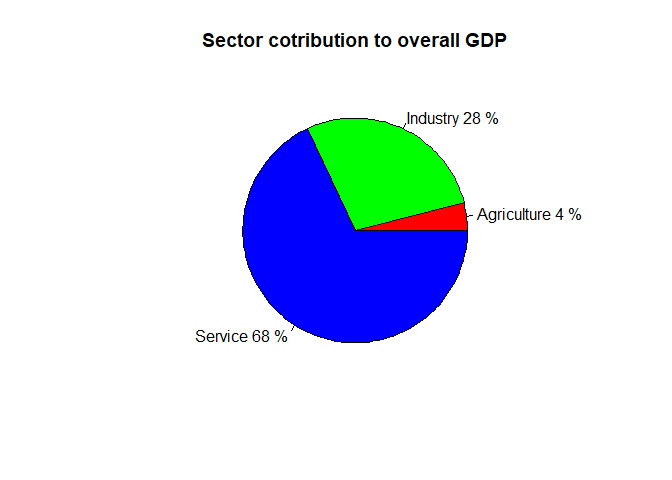
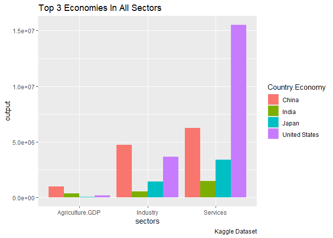
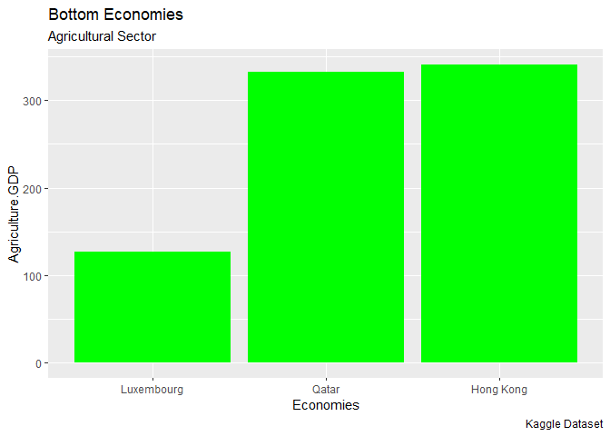
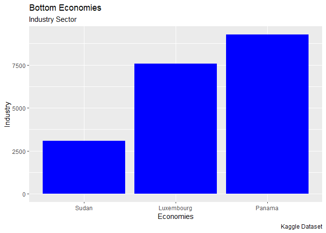
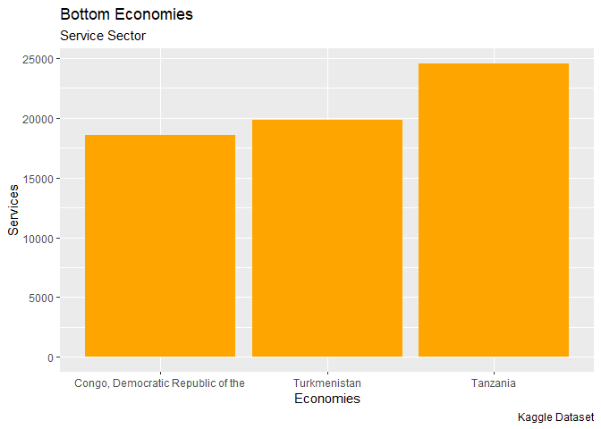
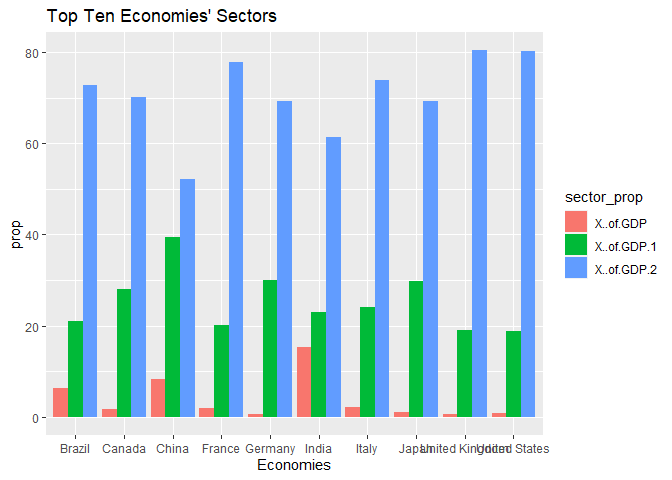
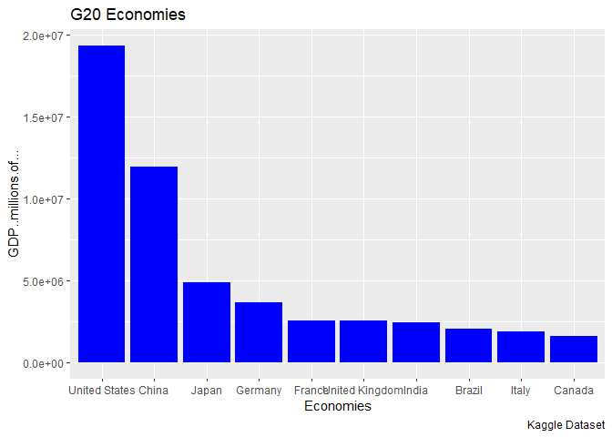
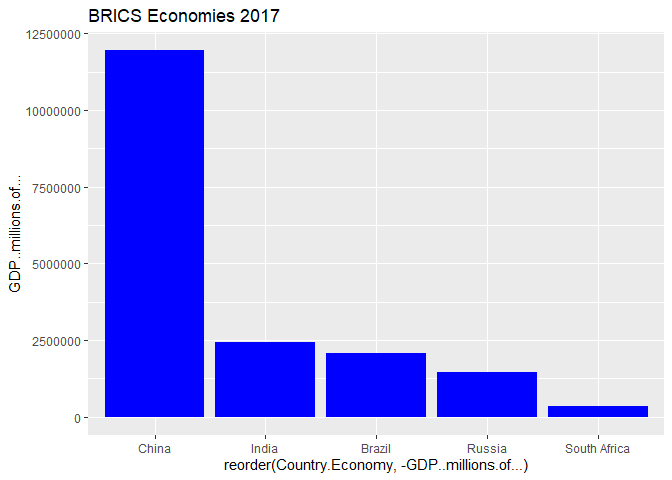
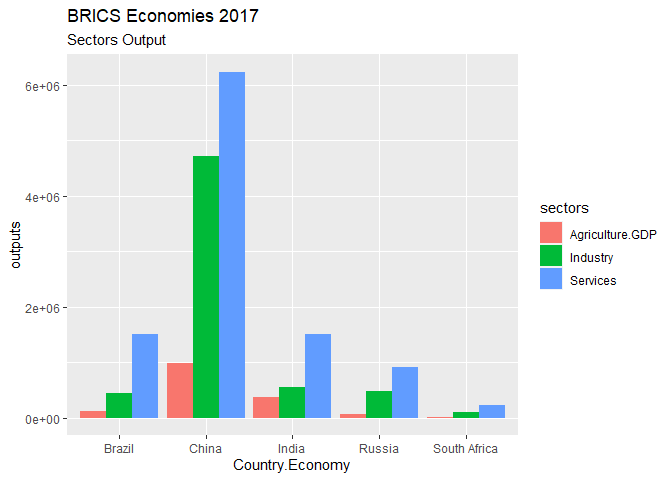
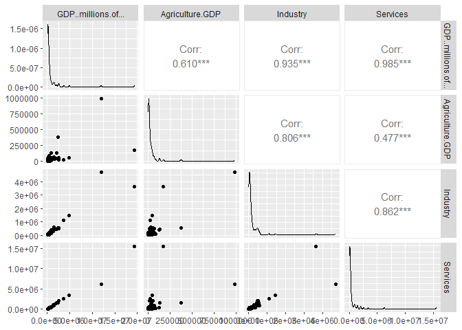

World-Economic-Analysis
================
Eric Mulaa
2023-05-01

I will load important packages that I will use in my analysis

``` r
library(tidyverse)
```

    ## ── Attaching core tidyverse packages ──────────────────────── tidyverse 2.0.0 ──
    ## ✔ dplyr     1.1.1     ✔ readr     2.1.4
    ## ✔ forcats   1.0.0     ✔ stringr   1.5.0
    ## ✔ ggplot2   3.4.2     ✔ tibble    3.2.1
    ## ✔ lubridate 1.9.2     ✔ tidyr     1.3.0
    ## ✔ purrr     1.0.1     
    ## ── Conflicts ────────────────────────────────────────── tidyverse_conflicts() ──
    ## ✖ dplyr::filter() masks stats::filter()
    ## ✖ dplyr::lag()    masks stats::lag()
    ## ℹ Use the conflicted package (<http://conflicted.r-lib.org/>) to force all conflicts to become errors

``` r
library(tidyr)
library(ggplot2)
library(GGally)
```

    ## Registered S3 method overwritten by 'GGally':
    ##   method from   
    ##   +.gg   ggplot2

Load the dataset which is in comma separated value (csv)format

``` r
gdp <- read.table(file = "GDPdata.csv", header = TRUE, sep = ",")
```

    ## Warning in scan(file = file, what = what, sep = sep, quote = quote, dec = dec,
    ## : EOF within quoted string

    ## Warning in scan(file = file, what = what, sep = sep, quote = quote, dec = dec,
    ## : number of items read is not a multiple of the number of columns

I need to have a look at the data I’m dealing with

``` r
summary(gdp)
```

    ##   Index.Number        Rank       Country.Economy    GDP..millions.of...
    ##  Min.   : 0.00   Min.   : 1.00   Length:91          Min.   :   40420   
    ##  1st Qu.:22.50   1st Qu.:23.50   Class :character   1st Qu.:   86125   
    ##  Median :45.00   Median :46.00   Mode  :character   Median :  219300   
    ##  Mean   :45.08   Mean   :46.08                      Mean   :  866843   
    ##  3rd Qu.:67.50   3rd Qu.:68.50                      3rd Qu.:  533925   
    ##  Max.   :91.00   Max.   :92.00                      Max.   :19360000   
    ##                                                     NA's   :1          
    ##  Agriculture.GDP      AGR.Rank           X..of.GDP         Industry      
    ##  Length:91          Length:91          Min.   : 0.000   Min.   :   3094  
    ##  Class :character   Class :character   1st Qu.: 2.025   1st Qu.:  24762  
    ##  Mode  :character   Mode  :character   Median : 4.300   Median :  75098  
    ##                                        Mean   : 7.313   Mean   : 240172  
    ##                                        3rd Qu.: 9.300   3rd Qu.: 174668  
    ##                                        Max.   :39.600   Max.   :4716300  
    ##                                        NA's   :1        NA's   :1        
    ##     IND.Rank       X..of.GDP.1       Services           SER.Rank    
    ##  Min.   :  1.00   Min.   : 2.60   Min.   :   18553   Min.   : 1.00  
    ##  1st Qu.: 23.25   1st Qu.:23.77   1st Qu.:   48984   1st Qu.:23.25  
    ##  Median : 45.50   Median :30.30   Median :  148690   Median :45.50  
    ##  Mean   : 46.84   Mean   :30.35   Mean   :  588870   Mean   :45.84  
    ##  3rd Qu.: 67.75   3rd Qu.:35.77   3rd Qu.:  354777   3rd Qu.:67.75  
    ##  Max.   :132.00   Max.   :61.40   Max.   :15526720   Max.   :97.00  
    ##  NA's   :1        NA's   :1       NA's   :1          NA's   :1      
    ##   X..of.GDP.2       Year.GDP     Year.Sector  
    ##  Min.   :28.40   Min.   :2016   Min.   :2011  
    ##  1st Qu.:55.62   1st Qu.:2017   1st Qu.:2017  
    ##  Median :61.45   Median :2017   Median :2017  
    ##  Mean   :62.08   Mean   :2017   Mean   :2017  
    ##  3rd Qu.:69.80   3rd Qu.:2017   3rd Qu.:2017  
    ##  Max.   :92.70   Max.   :2017   Max.   :2017  
    ##  NA's   :1       NA's   :1      NA's   :1

``` r
str(gdp)
```

    ## 'data.frame':    91 obs. of  15 variables:
    ##  $ Index.Number       : int  0 1 2 3 4 5 6 7 8 9 ...
    ##  $ Rank               : int  1 2 3 4 5 6 7 8 9 10 ...
    ##  $ Country.Economy    : chr  "United States" "China" "Japan" "Germany" ...
    ##  $ GDP..millions.of...: int  19360000 11940000 4884000 3652000 2575000 2565000 2439000 2081000 1921000 1640000 ...
    ##  $ Agriculture.GDP    : chr  "174240" "991020" "48840" "21912" ...
    ##  $ AGR.Rank           : chr  "3" "1" "13" "31" ...
    ##  $ X..of.GDP          : num  0.9 8.3 1 0.6 2 0.6 15.4 6.2 2.1 1.7 ...
    ##  $ Industry           : int  3659040 4716300 1450548 1099252 517575 487350 560970 437010 461040 460840 ...
    ##  $ IND.Rank           : int  2 1 3 4 7 8 6 12 10 11 ...
    ##  $ X..of.GDP.1        : num  18.9 39.5 29.7 30.1 20.1 19 23 21 24 28.1 ...
    ##  $ Services           : int  15526720 6232680 3384612 2530836 2005925 2062260 1499985 1514968 1419619 1151280 ...
    ##  $ SER.Rank           : int  1 2 3 4 6 5 8 7 9 10 ...
    ##  $ X..of.GDP.2        : num  80.2 52.2 69.3 69.3 77.9 80.4 61.5 72.8 73.9 70.2 ...
    ##  $ Year.GDP           : int  2017 2017 2017 2016 2017 2017 2017 2017 2017 2017 ...
    ##  $ Year.Sector        : int  2017 2017 2017 2017 2017 2017 2016 2017 2017 2017 ...

I wll need to convert Agriculture columns to numeric But first I will
have to use gsub function to avoid the introductions of NAS

``` r
gdp$Agriculture.GDP <- gsub(",", "", gdp$Agriculture.GDP)
gdp$Agriculture.GDP <- as.numeric(gdp$Agriculture.GDP)
```

    ## Warning: NAs introduced by coercion

``` r
gdp$AGR.Rank <- gsub(",", "", gdp$AGR.Rank)
gdp$AGR.Rank <- as.numeric(gdp$AGR.Rank)
```

    ## Warning: NAs introduced by coercion

let me get rid of incomplete entries if any

``` r
sum(is.na(gdp))
```

    ## [1] 14

``` r
gdp <- gdp[complete.cases(gdp), ]
```

lets check for duplicates

``` r
which(duplicated(gdp))
```

    ## integer(0)

lets see what % every sector contributes to overall gdp

``` r
x <- sum(gdp$GDP..millions.of...)
perc <- round(c(100*sum(gdp$Agriculture.GDP/x), 100*sum(gdp$Industry)/x, 100*sum(gdp$Services)/x))
lbl <- c("Agriculture", "Industry", "Service")
lbl1 <- paste(lbl, perc, "%", sep = " ")
pie(perc, labels = lbl1, main = "Sector cotribution to overall GDP", col = rainbow(length(perc)))
```

<!-- -->
It is clear that Service sector contributed to 68% on the overall GDP,
followed by Industrial output that account 28% of the overall GDP than
Agriculture with 4%

let see the top 3 economies in every sector I will need to load some
necessary packages

``` r
top <- gdp %>%
  filter(AGR.Rank <= 3| IND.Rank <= 3| SER.Rank <= 3) %>%
  select(Country.Economy, Agriculture.GDP, Industry, Services)
top <- gather(top, sectors, output, -1)
ggplot(top, aes(x = sectors, y = output, fill = Country.Economy))+ 
  geom_bar(stat = "identity", position = "dodge")+ 
  labs(title = "Top 3 Economies In All Sectors", caption = "Kaggle Dataset")
```

<!-- -->
From the above graph we see that in Agriculture sector, China is
leading, followed by India and the USA, In the Industry sector, China is
the leading economy, followed by USA and the Japan, In Service sector,
USA comes first, then China and Japan at the third place.

let see the bottom economies in each sector using slice function
1.Agricultural Sector

``` r
agri_min <- gdp %>%
  slice_min(Agriculture.GDP, n = 3)
ggplot(agri_min, aes(reorder(Country.Economy, Agriculture.GDP), Agriculture.GDP))+ 
  geom_bar(stat = "identity", fill = "green")+ 
  labs(title = "Bottom Economies", subtitle = "Agricultural Sector", 
       caption = "Kaggle Dataset", x = "Economies")
```

<!-- -->
from the above graph, it is clear that Luxembourg produced the least
output in Agriculture globally in 2017, then Qatar and then Hong Kong

2.Industrial Sector

``` r
ind_min <- gdp %>%
  slice_min(Industry, n = 3)
ggplot(ind_min, aes(reorder(Country.Economy, Industry), Industry))+ 
  geom_bar(stat = "identity", fill = "blue")+ 
  labs(title = "Bottom Economies", subtitle = "Industry Sector", 
       caption = "Kaggle Dataset", x = "Economies")
```

<!-- -->
From the graph of the least output in Industrial sector, Sudan was the
least, following Luxembourg and then Panama.

3.Service Sector

``` r
ser_min <- gdp %>%
  slice_min(Services, n = 3)
ggplot(ser_min, aes(reorder(Country.Economy, Services), Services))+ 
  geom_bar(stat = "identity", fill = "orange")+ 
  labs(title = "Bottom Economies", subtitle = "Service Sector", 
       caption = "Kaggle Dataset", x = "Economies")
```

<!-- -->
In the service sector we have DR Congo, Turkmenisatn and Tanzania as the
least Economies

Now let us see which sector output among the 3 (Agriculture, Industry,
and service) has been leading among the best 10 Economies of the world.

``` r
leading_prop <- gdp%>%
  filter(Rank <= 10) %>%
 gather(sector_prop, prop, X..of.GDP, X..of.GDP.1, X..of.GDP.2)

ggplot(leading_prop, aes(x = Country.Economy, y = prop, fill = sector_prop))+ 
  geom_bar(stat = "identity", position = "dodge")+ 
  labs(title = "Top Ten Economies' Sectors", x = "Economies")+ 
  scale_color_discrete(labels = c("Agriculture", "Industry", "Service"))
```

<!-- -->
from the graph we can see that among the 10 best economies in the world,
Service output is leading in all economies, then followed by Industrial
output and Agriculture contributes the least in all the top 10
economies.This is consistent in all these economies.

lets have an analysis of the G20 countries I will start by defining the
G20 nations

``` r
G20 <- c("Argentina", "Australia", "Brazil", "Canada", "China", 
         "India", "Indonesia", "Japan", "South Korea", "Mexico", 
         "Russia", "Saudi Arabia", "South Africa", "Turkey", "United Kingdom", 
         "United States", "Austria", "Belgium", "Bulgaria", "Croatia", 
         "Cyprus", "Czechia", "Denmark", "Estonia", "Finland", "France", 
         "Germany", "Greece", "Hungary", "Ireland", "Italy", "Latvia", 
         "Lithuania", "Luxembourg", "Malta", "Netherlands", "Poland", 
         "Portugal", "Romania", "Slovakia", "Slovenia", "Spain", "Sweden")
```

I will now visualize from gdp dataset where Economies is equal to G20

``` r
g20 <- gdp %>%
  filter(Country.Economy %in% G20, Rank <= 10)
ggplot(g20, aes(reorder(Country.Economy,-GDP..millions.of...), GDP..millions.of...))+ 
  geom_bar(stat = "identity", fill = "blue")+ 
  labs(title = "G20 Economies", caption = "Kaggle Dataset", x = "Economies") 
```

<!-- -->
from the graph above we can see that among the top 10 Economies of G20,
USA was leading, followed by China and Japan.

lets see about BRICS

``` r
brics <- c("Brazil", "Russia", "India", "China", "South Africa")
gdp_brics <- gdp %>%
  filter(Country.Economy %in% brics)
ggplot(gdp_brics, aes(reorder(Country.Economy,-GDP..millions.of...), GDP..millions.of...))+ 
  geom_bar(stat = "identity", fill = "blue")+ 
  labs(title = "BRICS Economies 2017")
```

<!-- -->
China is the best Economy of the Brics, followed by India and Brazil in
the third place. Russia and South Africa comes in the 4th and 5th place
respectively.

let us investigate on the specific sectors output for the BRICS

``` r
gdp_brics2 <- gdp_brics %>%
  gather(sectors, outputs, Agriculture.GDP, Industry, Services)
ggplot(gdp_brics2, aes(x = Country.Economy, y = outputs, fill = sectors))+ 
  geom_bar(stat = "identity", position = "dodge")+ 
  labs(title = "BRICS Economies 2017", subtitle = "Sectors Output")
```

<!-- -->
We see the same trend repeating itself, Service sector is has the most
output in all, followed by Industrial and Agricultural sectors.

let now chech for correlation in the dataset.

``` r
ggpairs(gdp, columns = c(4, 5, 8, 11))
```

<!-- -->

Conclusion: There is a positive correlation between overall GDP and
Agriculture, Industry, and Services. The correlation is strong for
Industry and Services. There is a strong correlation between Agriculture
ouput and Service, and between Industry and Services. However the
correlation between Agriculture and Services is weak.

we can have a model explaining relationship between different aspects in
our data

``` r
gdpmodel <- lm(gdp$GDP..millions.of... ~ gdp$Agriculture.GDP + 
     gdp$Agriculture.GDP + gdp$Industry + gdp$Services)
summary(gdpmodel)
```

    ## 
    ## Call:
    ## lm(formula = gdp$GDP..millions.of... ~ gdp$Agriculture.GDP + 
    ##     gdp$Agriculture.GDP + gdp$Industry + gdp$Services)
    ## 
    ## Residuals:
    ##    Min     1Q Median     3Q    Max 
    ##  -2902  -1551  -1511  -1418  83374 
    ## 
    ## Coefficients:
    ##                      Estimate Std. Error t value Pr(>|t|)    
    ## (Intercept)         1.532e+03  1.079e+03    1.42    0.159    
    ## gdp$Agriculture.GDP 1.003e+00  2.209e-02   45.42   <2e-16 ***
    ## gdp$Industry        9.986e-01  6.678e-03  149.53   <2e-16 ***
    ## gdp$Services        1.000e+00  1.605e-03  623.31   <2e-16 ***
    ## ---
    ## Signif. codes:  0 '***' 0.001 '**' 0.01 '*' 0.05 '.' 0.1 ' ' 1
    ## 
    ## Residual standard error: 9505 on 85 degrees of freedom
    ## Multiple R-squared:      1,  Adjusted R-squared:      1 
    ## F-statistic: 1.969e+06 on 3 and 85 DF,  p-value: < 2.2e-16
